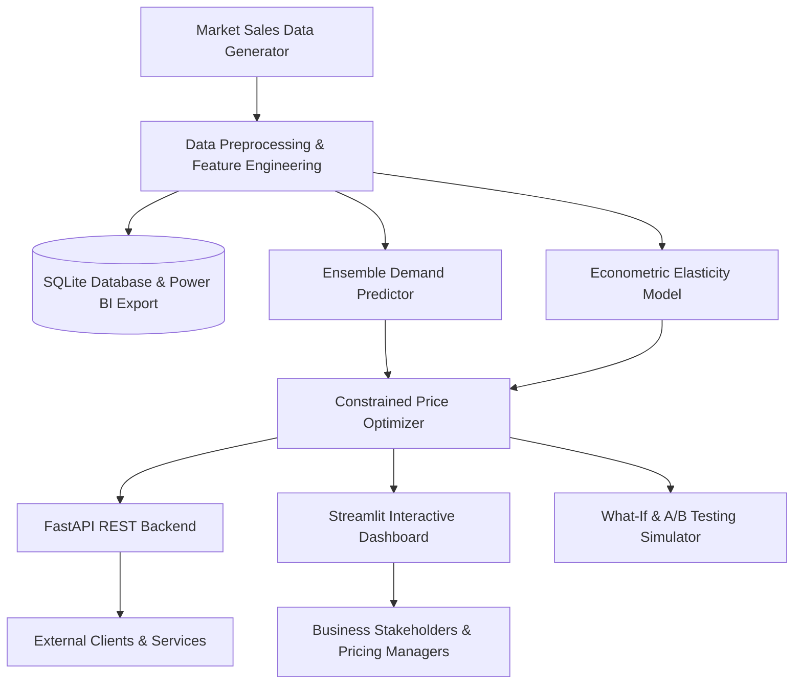

# ⚡ Dynamic Pricing & Demand Prediction System

<div align="center">

[](https://www.python.org/)
[](https://opensource.org/licenses/MIT)
[](https://fastapi.tiangolo.com)
[](https://streamlit.io)
[](https://scikit-learn.org)
[](https://www.docker.com/)

**An end-to-end, production-grade Machine Learning & Constrained Optimization system for Price Elasticity estimation, Demand Forecasting, and Real-Time Dynamic Pricing.**

[Key Features](#-key-features) • [System Architecture](#-system-architecture) • [Mathematical Formulations](#-mathematical-formulations) • [Installation & Quickstart](#-installation--quickstart) • [Interactive Dashboard](#-interactive-dashboard) • [REST API Documentation](#-rest-api-documentation) • [SQL & Power BI Integration](#-sql--power-bi-integration)

</div>

---

## 📌 Overview

The **Dynamic Pricing & Demand Prediction System** solves modern revenue management challenges across E-Commerce, Hospitality, Rideshare, and Retail. By combining **econometric log-log Price Elasticity of Demand (PED)** modeling with **Gradient Boosted / Random Forest Ensembles** and **numerical constrained optimization**, the platform dynamically identifies profit- and revenue-maximizing price points while respecting inventory levels, competitor actions, and business guardrails.

### 🌟 Highlights & Resume Milestones
- **Data-Driven Sales & Demand Modeling:** Analyzes multi-category historical transactions to understand elasticity regimes and seasonal demand surges.
- **Ensemble Demand Predictor:** Combines Gradient Boosting, Random Forest, and Regularized ElasticNet to achieve low RMSE and robust out-of-sample generalization.
- **Constrained Pricing Optimizer:** Maximizes objective functions (Profit, Revenue, Balanced) subject to price floors, maximum allowed percentage jumps, and minimum margin constraints.
- **Interactive Streamlit & Power BI Analytics:** Real-time simulation curves, scenario What-If matrices, randomized A/B testing with hypothesis testing ($p$-values), and direct SQLite/Excel export pipelines.

---

## 🏗️ System Architecture



---

## 📐 Mathematical Formulations

### 1. Price Elasticity of Demand (PED)
The system calculates point and arc elasticity to classify items into *Elastic*, *Inelastic*, or *Unitary Elastic* regimes:
$$\text{PED} = \frac{\% \Delta Q}{\% \Delta P} = \frac{\partial Q}{\partial P} \cdot \frac{P}{Q}$$

Econometric log-log estimation:
$$\ln(Q_i) = \beta_0 + \beta_1 \ln(P_i) + \beta_2 \ln(P_{\text{comp}, i}) + \beta_3 \text{Holiday}_i + \beta_4 \text{Rating}_i + \epsilon_i$$
where $\beta_1$ represents constant own-price elasticity and $\beta_2$ represents cross-price elasticity.

### 2. Constrained Profit Maximization
The optimization engine solves:
$$\max_{P} \quad \Pi(P) = (P - C) \cdot \hat{Q}(P; \mathbf{X})$$
$$\text{subject to:}$$
$$P \ge C \cdot (1 + m_{\text{min}}) \quad \text{(Minimum margin floor)}$$
$$P_{\text{current}} \cdot (1 - \delta_{\text{max}}) \le P \le P_{\text{current}} \cdot (1 + \delta_{\text{max}}) \quad \text{(Price fluctuation shock dampener)}$$

---

## 🚀 Installation & Quickstart

### Prerequisites
- Python 3.9+ or Docker
- Git

### 1. Clone & Setup
```bash
git clone https://github.com/Jeelanimohammad/Dynamic-Pricing-Demand-Prediction-System.git
cd Dynamic-Pricing-Demand-Prediction-System
```

### 2. Install Dependencies
```bash
pip install -r requirements.txt
```

### 3. Run Pipeline (Train Models & Generate DB)
```bash
python cli.py train --force-regenerate
```

### 4. Launch Interactive Streamlit Dashboard
```bash
streamlit run streamlit_app.py
```
Open your browser at `http://localhost:8501`.

### 5. Launch FastAPI REST Server
```bash
uvicorn src.api.app:app --host 0.0.0.0 --port 8000 --reload
```
Interactive Swagger API docs available at `http://localhost:8000/docs`.

---

## 💻 Command Line Interface (CLI)

The repository provides a rich CLI for automated training, evaluation, and pricing inference:

```bash
# Generate 365 days of synthetic transactions
python cli.py generate-data --days 365

# Train and cross-validate ensemble demand and elasticity models
python cli.py train

# Optimize price for a specific product
python cli.py optimize --product-id ELEC_001 --price 199.99 --cost 85.00 --objective profit

# Predict demand at target price point
python cli.py predict --product-id ELEC_001 --price 215.00

# View saved model evaluation metrics
python cli.py evaluate
```

---

## 📊 Interactive Dashboard Modules

The **Streamlit Web Application** includes 6 dedicated views:

1. 🎯 **Real-Time Price Optimizer:** Live price vs. demand/profit curves with interactive sliders for unit cost, competitor price, inventory stock, and ad spend.
2. 📊 **Executive Performance & Trends:** Gross revenue, net profit margin, category breakdown, and SKU unit economics.
3. 🔮 **Demand Forecasting & What-If:** Scenario simulation matrices testing competitor price drops and holiday surges.
4. 🧪 **A/B Testing Cohort Simulator:** Randomized Bernoulli trial simulator comparing static vs. dynamic pricing with two-sample $t$-test and $p$-value statistical significance.
5. 🧠 **Model Diagnostics & Elasticity:** Model performance metrics (RMSE, MAE, MAPE, $R^2$), tree feature importances, and product PED tables.
6. 💾 **SQL Analytics & Data Export:** In-browser SQLite SQL querying terminal and one-click Power BI / Excel exports.

---

## 🌐 REST API Endpoints

| Method | Endpoint | Description |
|---|---|---|
| `GET` | `/api/health` | Service health status and model checkpoint check |
| `GET` | `/api/products` | Predefined product catalog templates and baseline values |
| `POST` | `/api/predict-demand` | Forecasts demand and financial return for custom conditions |
| `POST` | `/api/optimize-price` | Computes optimal constrained price point and simulation curves |
| `GET` | `/api/elasticity/{product_id}` | Returns econometric price elasticity profile |
| `POST` | `/api/simulate/what-if` | Multi-variable scenario evaluation |
| `POST` | `/api/simulate/ab-test` | Randomized A/B cohort experiment simulation |
| `POST` | `/api/retrain` | Triggers retraining and hot-reloads model weights |

---

## 📈 SQL & Power BI Integration

The preprocessing pipeline automatically exports:
1. **SQLite Database (`data/pricing_system.db`):** Contains normalized `sales_transactions`, `dim_products`, and `daily_category_metrics` tables for ad-hoc business intelligence SQL queries.
2. **Power BI / Excel Workbook (`data/power_bi_sales_data.xlsx`):** Multi-sheet workbook with `Product_Performance`, `Monthly_Trends`, and `Recent_Transactions` ready for direct Power BI data model import.

---

## 🧪 Testing Suite

Run the full automated test suite:
```bash
pytest tests/ -v
```

---

## 🐳 Docker Deployment

Run both the API and Streamlit Dashboard using Docker Compose:
```bash
docker-compose up --build
```
- Dashboard: `http://localhost:8501`
- API: `http://localhost:8000`

---

## 📄 License

This project is licensed under the MIT License - see the [LICENSE](LICENSE) file for details.